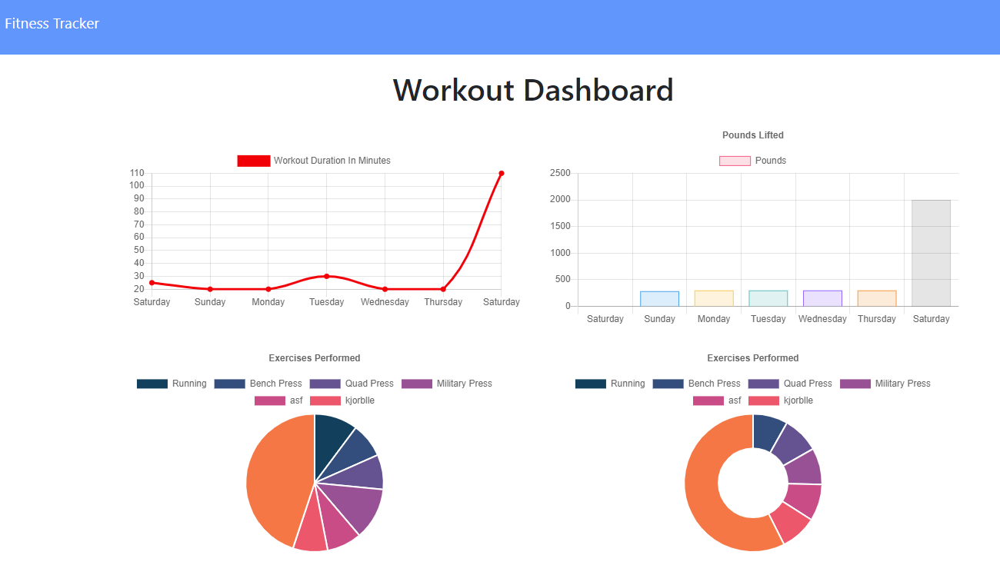
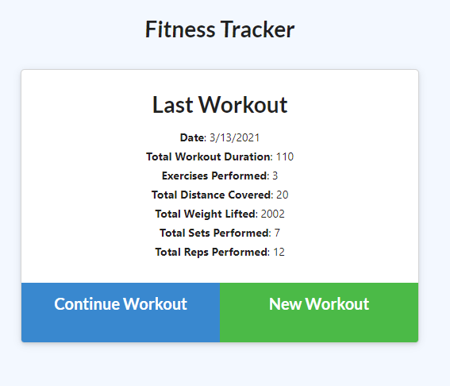

# Workout-Tracker-MongoDB

## Description

You want to track your workouts? Maybe fool your loved ones? You can track weights, the name of the exercise, the type, the duration, the reps, the sets, and the distance! All neatly displayed in the dashboard page the the form of various graphs!

Deployed app: workout-tracker-mongodb5000.herokuapp.com

## Contributing

There are many ways in which you can participate in the project, for example: 
* Submit bugs and feature requests to the email below, and help us verify as they are checked in 
* Review source code changes
* Review the documentation and make pull requests for anything from typos to new content

## Questions

For any additional questions see my [GitHub profile](http://github.com/tylerpetri) or contact tylerpetri@hotmail.com